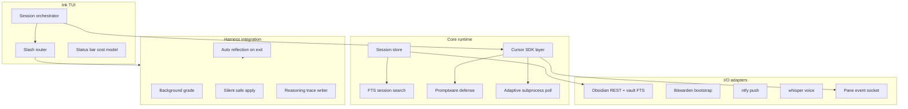

# CursorSI CLI Build Plan

> **Roadmap:** [SISPACE_PLAN.md](./SISPACE_PLAN.md) (v1, shipped) · [SISPACE_V2_PLAN.md](./SISPACE_V2_PLAN.md) (desktop shell) · **this document** (CLI agent runtime)

**Status:** Planning only — no implementation in this milestone.  
**Repo layout (locked):** monorepo package at [`cli/`](cli/), binary name `cursorsi`.  
**Last updated:** 2026-06-03

---

## Product definition

**CursorSI CLI** (`cursorsi`) is a terminal-native Cursor agent client inspired by **Hermes** agent design velocity: Ink TUI, multi-session orchestration, slash commands, sub-300ms cold start, and session search without LLM cost.

| In scope | Out of scope |
|----------|--------------|
| Headless/SSH-friendly agent loops | Replacing Cursor IDE as editor |
| Standalone terminal workflows | Re-implementing full SISpace kanban in Ink |
| SISpace V2 pane runtime (`--pane-mode`) | Porting Hermes source verbatim |
| Harness-native auto-reflection | Storing API keys in repo |

**Cold start target:** `cursorsi --version` completes in **&lt;300ms** on a warm filesystem cache (Hermes velocity: deferred imports, lazy SDK/harness/whisper loads, compression-check deferral).

---

## Relationship to SISpace v1

Reuse without rewriting:

| Asset | Path | CLI usage |
|-------|------|-----------|
| Harness dist | [`harness/scripts/dist/`](harness/scripts/dist/) | `post-task-chain`, `workflow-sdk`, orchestrator |
| Obsidian config | [`harness/config/obsidian.yaml`](harness/config/obsidian.yaml) | Vault paths, REST base URL |
| Skill bundles | [`config/skill-bundles/`](config/skill-bundles/) | `/feature`, `/bug`, `/docs` loaders |
| Task search shapes | [`src-tauri/src/db/search.rs`](src-tauri/src/db/search.rs) | Port FTS discovery/scroll/browse |
| Model IDs | [`lib/pipeline-models.mjs`](lib/pipeline-models.mjs) | `--model`, orchestrator vs subagent |
| Task note schema | [`docs/obsidian-task-schema.md`](docs/obsidian-task-schema.md) | `--resume`, Obsidian context |
| Sidecar patterns | [`lib/node-server.mjs`](lib/node-server.mjs), [`lib/pipeline-run.mjs`](lib/pipeline-run.mjs) | Optional; prefer in-process harness for CLI |

**SQLite (locked):** share `~/.local/share/sispace/tasks.db` with SISpace v1/v2 for `kanban`, `resume`, and cost aggregation continuity.

---

## Architecture overview



---

## Hermes parity matrix

Features to match or exceed Hermes velocity; mapping to CLI modules and v1 reuse.

| Hermes / velocity feature | CLI module | v1 reuse | Notes |
|---------------------------|------------|----------|-------|
| Ink multi-session orchestrator | `cli/src/tui/orchestrator.tsx` | — | Switch sessions without leaving TUI |
| Slash commands | `cli/src/commands/slash.ts` | Mirror `.cursor/commands/harness-*.md` | See § Slash commands |
| Skill bundles | `cli/src/skills/bundles.ts` | `config/skill-bundles/*.yaml` | One command loads whole workflow |
| Session search &lt;20ms | `cli/src/search/fts.ts` | `task_search` semantics | discovery / scroll / browse |
| BridgeVoice-style voice | `cli/src/voice/whisper.ts` | — | Transcribe → paste into prompt |
| Cold start &lt;300ms | `cli/bin/cursorsi.mjs` entry | — | Deferred imports; no SDK at `--version` |
| Adaptive subprocess polling | `cli/src/runtime/poll.ts` | — | Minimize per-tool-call overhead |
| Promptware defense | `cli/src/security/promptware.ts` | Extend v1 sanitizer if present | Scan memory + tool results |
| Bitwarden Secrets Manager | `cli/src/secrets/bws.ts` | — | One bootstrap token → env |
| ntfy push | `cli/src/notify/ntfy.ts` | — | Completion alerts; no account |
| Per-session model override | `cli/src/session/model.ts` | `pipeline-models` ids | `cursorsi --model opus` |
| Paste collapse thresholds | `cli/src/tui/paste.ts` | — | Configurable collapse for large pastes |
| Background review fork | `cli/src/harness/review-fork.ts` | checker agents in workflow-sdk | Non-blocking reviewer |
| Hot-path call reduction | design budget across runtime | — | Target ~47% fewer calls/turn vs naive loop |
| `cursorsi kanban` | `cli/src/sispace/kanban.ts` | release `sispace` binary | Launch SISpace desktop |
| `cursorsi swarm` | `cli/src/sispace/swarm.ts` | `swarm_create`, sidecar | Terminal swarm topology |

### Explicitly not in Hermes velocity (defer or omit)

- Hermes-specific cloud sync UI
- Proprietary Hermes model routing (use Cursor SDK + project config)
- Any feature not listed in product brief unless added via harness proposal

---

## Harness-native differentiators

These go **beyond** Hermes parity and define why `cursorsi` exists in this monorepo.

### Auto-reflection on session end

- On normal session teardown (not `--no-reflect`), CLI runs equivalent of [`post-task-chain.js`](harness/scripts/dist/post-task-chain.js):
  1. Reflection agent → proposal (or explicit no-proposal)
  2. Grading agent → score (background; non-blocking TUI)
  3. Rollout gate → apply per [`harness/config/harness.yaml`](harness/config/harness.yaml)
- **Safe categories** (`docs`, `memory`, `backtests`) may apply silently when `auto_apply.enabled`.
- **Locked categories** (`rules`, `hooks`, `skills`, `commands`, `mcp`, `user-model`) log to [`harness/reports/rollout-log.md`](harness/reports/rollout-log.md) as pending; user runs `/apply` or SISpace harness panel.
- Duplicate guard: respect `generationAlreadyLogged()` and task `reflection_locked` when session is bound to `task_id`.

### Obsidian-as-memory

- Session **start**: FTS vault for relevant lessons ([`harness/memory/accepted-lessons.md`](harness/memory/accepted-lessons.md), reasoning patterns, related task notes).
- Inject **on demand** into first user turn or `/recall` — never stuff full vault into system prompt.
- Align with v1 “RAG without prompt stuffing” ([`SISPACE_PLAN.md`](SISPACE_PLAN.md) § Obsidian).

### Reasoning trace capture

- After each session, append structured **WHY** blocks to [`harness/memory/reasoning-patterns.md`](harness/memory/reasoning-patterns.md) (not only WHAT happened).
- Format: `PATTERN-YYYYMMDD-HHMMSS` + decision points + rejected alternatives.

### Cross-session continuity

```bash
cursorsi --resume t_abc123
```

- Rebuild context from Obsidian task note + `task_messages` in shared SQLite.
- Restore model, cwd, skill bundle, optional `cursor_agent_id` / session id for SDK resume.

### Swarm blackboard

- When `--swarm` or `/swarm`, coordinate via `## Blackboard` on root Obsidian note ([`docs/obsidian-task-schema.md`](docs/obsidian-task-schema.md)).
- Workers read/write through Obsidian MCP; CLI prints blackboard diff in TUI sidebar.

### Verification gate (ralph-style)

```bash
cursorsi goal set "implement Lagrange module" --verify "sh verify.sh"
```

- Agent proposes file changes → CLI runs verify script → apply only on **exit 0**.
- Failed verify loops back to agent with stderr tail (bounded).

### Goal tracking

- Persist goals in [`harness/memory/goals.md`](harness/memory/goals.md) (`GOAL-YYYYMMDD-NNN` schema).
- `/goal` slash family: set, list, status, run loop.

### Cost tracking

- Track Cursor API usage per session, task, project (credits or token proxy).
- Ink status bar: `session: 12.4k | task: 48k | project: 1.2M`.
- Emit `cost_update` pane events for SISpace V2 meta-orchestrator.

### Agent handoff

```bash
cursorsi handoff export <session-id>   # writes handoff blob
cursorsi handoff attach <session-id>   # new terminal, full context
```

- Blob: session metadata, last N messages, model, cwd, task id, SDK resume handle (if available).

### Live diff viewer

- Inline unified diff in TUI (optional panel) of agent-proposed changes before commit/apply.
- Uses git diff or patch output; collapsible hunks (paste collapse thresholds).

### Harness doctor inline

- `/doctor` runs meta-readiness checks (same milestones as v1 Settings doctor).
- Render inline in TUI; no need to open SISpace.

---

## Pane mode (SISpace V2 integration)

When embedded in SISpace V2 terminal grid:

```bash
cursorsi --pane-mode --event-socket ~/.local/share/sispace/panes/<pane-id>.sock
```

| Mode | Ink UI | PTY output | JSON events |
|------|--------|------------|-------------|
| Interactive (default) | Full orchestrator | Normal | Optional |
| `--pane-mode` | Minimal / status line only | Primary UX | **Required** |

PTY carries human-readable logs; **meta-orchestrator never parses PTY text**. All machine-readable state flows through JSON lines on the event socket.

See [SISPACE_V2_PLAN.md § Pane IPC](./SISPACE_V2_PLAN.md#pane-ipc-protocol) for consumer side.

---

## Pane event schema (JSON lines)

One JSON object per line (NDJSON). Transport: **Unix domain socket** (recommended) at `~/.local/share/sispace/panes/<pane-id>.sock`. Alternative: inherited FD (pick one in Phase 0e implementation).

### Envelope

```json
{
  "type": "step_done",
  "sessionId": "sess_…",
  "taskId": "t_abc123",
  "paneId": "pane_01",
  "timestamp": "2026-06-03T15:00:00.000Z",
  "payload": { }
}
```

### Event types

| type | payload fields | When |
|------|----------------|------|
| `session_start` | `model`, `cwd`, `skillBundle` | Session begins |
| `step_start` | `agent`, `index`, `total` | Pipeline/specialist step starts |
| `step_done` | `agent`, `index`, `total`, `status`, `backend` | Step completes (no full `result` body) |
| `agent_complete` | `status`, `summary` | Agent turn finished |
| `cost_update` | `sessionTokens`, `taskTokens`, `projectTokens` | Periodic or on turn end |
| `reflection_started` | — | Auto-reflect began |
| `reflection_done` | `proposalId`, `noProposal` | Reflect finished |
| `error` | `message`, `code` | Recoverable or fatal |
| `session_end` | `reason` | Normal exit, crash, handoff |

**Size limits:** no event line &gt; 8KB; large content stays in SQLite/Obsidian, referenced by id in payload.

---

## CLI surface

### Global flags

| Flag | Description |
|------|-------------|
| `--model <id>` | Per-session model override (e.g. `composer-2.5`, opus variants) |
| `--subagent-model <id>` | Subagent tier when running pipeline |
| `--project <path>` | Project root / cwd default |
| `--resume <task-id>` | Load task + messages + note |
| `--no-reflect` | Skip auto-reflection on exit |
| `--voice` | Enable whisper push-to-talk |
| `--notify-topic <topic>` | ntfy topic for completion |
| `--pane-mode` | Minimal TUI + pane event socket |
| `--event-socket <path>` | Unix socket for NDJSON events |

### Subcommands

| Command | Description |
|---------|-------------|
| `cursorsi session [new\|list\|switch\|kill]` | Session CRUD inside orchestrator |
| `cursorsi search <query>` | FTS session search (discovery mode default) |
| `cursorsi kanban` | Launch SISpace release binary |
| `cursorsi swarm <root-task-id>` | Create/run swarm from terminal |
| `cursorsi goal …` | Goal set/list/run with optional `--verify` |
| `cursorsi doctor` | Meta-readiness report |
| `cursorsi handoff export\|attach` | Session handoff |
| `cursorsi workspace apply <preset>` | Launch V2 layout (Phase 2+; calls SISpace) |
| `cursorsi version` | Version string (cold path) |

### Slash commands (in-session)

| Slash | Action |
|-------|--------|
| `/reflect` | Manual reflection trigger |
| `/grade` | Grade pending proposal |
| `/apply` | Apply accepted proposal (respect locked layers) |
| `/curate` | Skill consolidation proposals (read-only emit) |
| `/swarm` | Swarm controls |
| `/goal` | Goal CRUD |
| `/harness` | Harness status summary |
| `/doctor` | Inline doctor |
| `/feature` | Load feature skill bundle (researcher+architect+coder+checker…) |
| `/bug` | Load bug bundle |
| `/docs` | Load docs bundle |
| `/recall <query>` | Obsidian FTS recall into context |

Skill bundle slash commands load agent definitions from [`.cursor/agents/`](.cursor/agents/) + [`config/skill-bundles/`](config/skill-bundles/) in one shot (Hermes skill bundles pattern).

---

## Session search

Port v1 **session_search** three shapes to CLI (target **&lt;20ms**, no LLM):

1. **Discovery** — `cursorsi search "auth middleware"` → top N sessions with snippet, bookend windows.
2. **Scroll** — `cursorsi search --task t_abc --before 500` → paginate messages.
3. **Browse** — `cursorsi search --task t_abc --offset 0 --limit 50` → chronological slice.

Implementation: SQLite FTS on `task_messages` (shared DB) or CLI-local mirror table synced on write.

---

## Internal package layout

```
cli/
  package.json
  bin/cursorsi.mjs          # thin entry; dynamic import core
  src/
    tui/                    # Ink orchestrator, panes, paste collapse
    sdk/                    # Cursor SDK wrap, cloud/local
    session/                # session model, resume, handoff
    search/                 # FTS discovery/scroll/browse
    harness/                # reflect, grade, apply, goals
    secrets/                # Bitwarden bootstrap
    notify/                 # ntfy
    voice/                  # whisper
    security/               # promptware
    runtime/                # adaptive poll, hot-path budget
    diff/                   # unified diff viewer
    verify/                 # verify gate runner
    sispace/                # kanban, swarm launchers
    pane/                   # --pane-mode event emitter
```

### Session model (SQLite + optional JSON sidecar)

| Field | Description |
|-------|-------------|
| `session_id` | UUID |
| `task_id` | Optional link to `tasks.id` |
| `model_id` | Orchestrator model |
| `subagent_model_id` | Pipeline subagent model |
| `cwd` | Working directory |
| `skill_bundle` | Active bundle name |
| `cursor_agent_id` | SDK run id for resume |
| `handoff_path` | Last handoff blob |
| `cost_session` | Running token/credit tally |

### Hot-path design budget

- Batch subprocess status reads (adaptive interval: idle 500ms → active 50ms).
- Coalesce SDK polling with single `Promise.race` per turn.
- Defer harness dist import until first agent turn or `/reflect`.
- Target: **47% fewer function calls per turn** vs naive poll loop (document baseline in Phase 0b).

### Promptware defense

Scan on:

- Recalled Obsidian snippets before injection
- Tool results before model re-entry
- User paste before accept (optional)

Pattern classes: Brainworm-style instruction override, fake system tags, `ignore previous` chains, base64-nested payloads. Action: quarantine block with logged incident (no silent strip without audit).

### Bitwarden bootstrap

1. Read `BWS_ACCESS_TOKEN` or `bws login` session.
2. Fetch org secrets map once per process.
3. Map to `CURSOR_API_KEY`, `OBSIDIAN_API_KEY`, ntfy tokens — never write to disk.

---

## Build phases (CLI 0–1)

### Phase 0 — Skeleton and velocity

| Subphase | Ships | Verify |
|----------|-------|--------|
| **0a** | `cli/` package, `cursorsi --version` &lt;300ms, Ink shell, session list/switch | `time cursorsi --version` |
| **0b** | Slash router stub, Cursor SDK minimal REPL loop | One successful local agent turn |
| **0c** | FTS session search (discovery) | &lt;20ms on 10k messages benchmark |
| **0d** | Bitwarden bootstrap stub, ntfy on session end, voice stub | ntfy receives test ping |
| **0e** | `--pane-mode` + Unix socket NDJSON emitter | V2 Phase 2 integration test |

### Phase 1 — Harness integration

| Subphase | Ships | Verify |
|----------|-------|--------|
| **1a** | Auto-reflection on exit; background grade; silent safe apply | Session end updates `latest-reflection.md` without manual `/reflect` |
| **1b** | Obsidian context on start; `--resume <task-id>` | Resume reconstructs note + messages |
| **1c** | `goal set --verify`, diff viewer, verification gate | verify.sh gate blocks bad apply |
| **1d** | `kanban`, `swarm`, handoff, cost status bar | `cursorsi kanban` opens SISpace |
| **1e** | Full pane event schema + `cost_update` | Meta-orchestrator receives events in V2 Phase 4 |

---

## Verification checklist

| Check | Method |
|-------|--------|
| Cold start | `hyperfine 'cursorsi --version'` median &lt;300ms |
| Search latency | SQLite EXPLAIN + 10k message fixture |
| Auto-reflect | End session → `harness/reports/latest-reflection.md` mtime updates |
| Promptware | Golden injection strings → blocked with log |
| Pane events | Emit all types; no line &gt;8KB; socket reconnect handled |
| Shared DB | `resume` sees SISpace-created task |

---

## Locked decisions

| # | Decision |
|---|----------|
| 1 | Monorepo `cli/` package |
| 2 | Shared `~/.local/share/sispace/tasks.db` |
| 3 | `--pane-mode` + Unix socket NDJSON for V2 (not PTY scraping) |
| 4 | Auto-reflection default on; `--no-reflect` opt-out |
| 5 | Harness locked layers never silent-apply from CLI |

## Open questions

| # | Question | Default recommendation |
|---|----------|------------------------|
| 1 | whisper: GPU vs CPU model | CPU default; `CUDA_VISIBLE_DEVICES` opt-in |
| 2 | Pane transport: socket vs FD | Unix socket |
| 3 | CLI embeds node sidecar vs in-process harness | In-process harness; sidecar optional for parity tests |
| 4 | Opus / 1M context model IDs | Align with Cursor API catalog at 0b |

---

## Key files to leverage

- [`harness/scripts/dist/post-task-chain.js`](harness/scripts/dist/post-task-chain.js)
- [`harness/scripts/dist/lib/workflow-sdk.js`](harness/scripts/dist/lib/workflow-sdk.js)
- [`harness/scripts/dist/lib/harness-orchestrator.js`](harness/scripts/dist/lib/harness-orchestrator.js)
- [`src-tauri/src/services/harness_client.rs`](src-tauri/src/services/harness_client.rs) — spawn/reflect pattern
- [`lib/pipeline-run.mjs`](lib/pipeline-run.mjs) — slim SSE patterns for step events

---

*Planning document only. Implementation tracked in repo issues / future phase commands.*
