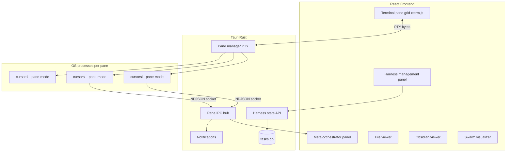
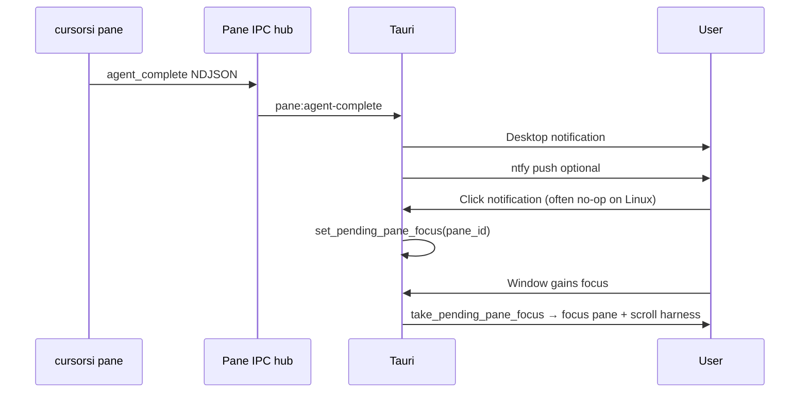
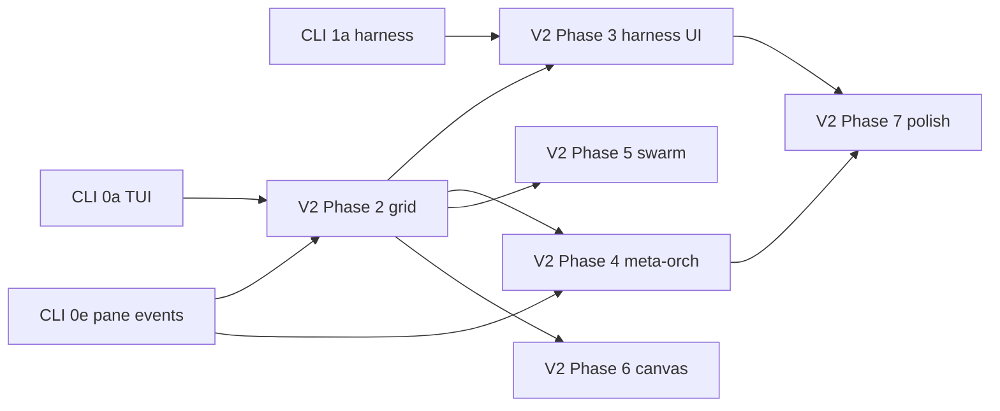

# SISpace V2 Build Plan

> **Roadmap:** [SISPACE_PLAN.md](./SISPACE_PLAN.md) (v1, shipped) · [CURSORSI_CLI_PLAN.md](./CURSORSI_CLI_PLAN.md) (CLI runtime) · **this document** (terminal-centric desktop)

**Status:** Planning only — no implementation in this milestone.  
**Last updated:** 2026-06-03

---

## Vision

SISpace V2 is a **terminal-centric redesign** of the self-improvement desktop app. The primary interface is a **grid of terminal panes** running `cursorsi`, not a kanban-first webview with a chat panel. React becomes **layout chrome** (pane grid, harness panel, file viewer, swarm graph). Tauri manages **process isolation**, **PTY bridging**, and **structured pane IPC**.

Inspired by **BridgeSpace-style** architecture: AI runs in isolated OS processes; the app orchestrates spawn, layout, and focus. If one pane crashes, others keep running.



---

## v1 delta summary

| Area | v1 (shipped) | V2 |
|------|--------------|-----|
| Primary UX | Kanban + TaskPanel agent chat | Terminal grid + harness panel |
| Agent surface | Virtualized chat in webview | `cursorsi` in embedded xterm.js |
| Terminals | External kitty/alacritty ([`terminal_spawn`](src-tauri/src/commands/terminal.rs)) | **Embedded PTY** per pane; external = escape hatch only |
| Orchestration | Pipeline SSE in UI | Meta-orchestrator reads **JSON pane events** |
| Harness UI | Settings sub-panel + doctor | **First-class harness panel** (priority) |
| SICanvas | N/A | Phase 6: external browser attach |

**Reuse (do not rewrite):** SQLite schema and migrations, [`harness/scripts/dist/`](harness/scripts/dist/), Obsidian integration, swarm FSM ([`src-tauri/src/db/swarm.rs`](src-tauri/src/db/swarm.rs)), doctor/meta-readiness ([`src-tauri/src/services/doctor.rs`](src-tauri/src/services/doctor.rs)), node sidecar patterns ([`lib/node-server.mjs`](lib/node-server.mjs)), pipeline slim SSE ([`lib/pipeline-run.mjs`](lib/pipeline-run.mjs)).

**Deprecate gradually:** TaskPanel chat as **primary** agent UI; keep as optional read-only mirror or “open task detail” until users migrate.

---

## Workspace types

| Workspace | ID | Purpose | Default layout |
|-----------|-----|---------|----------------|
| **SISpace** | `sispace` | General multi-agent dev | N agent panes + file viewer + harness panel |
| **SISwarm** | `siswarm` | Parallel swarm topology | coordinator pane + worker panes + visualizer + Obsidian blackboard |
| **SICanvas** | `scanvas` | UI/design feedback | agent pane + **external browser** + selection HUD |

Workspace type selects preset templates, panel visibility, and Tauri command namespace (`workspace_open`, `workspace_save_preset`).

---

## Core panels

### Terminal grid (primary)

Each **pane** is a first-class object:

```typescript
interface WorkspacePane {
  id: string;
  title: string;
  cwd: string;
  command: string;           // default: cursorsi --pane-mode ...
  taskId?: string;
  skillBundle?: string;
  modelId?: string;
  subagentModelId?: string;
  eventSocket: string;       // ~/.local/share/sispace/panes/<id>.sock
  ptyMasterFd?: number;      // Rust-internal
  pid?: number;
  status: "starting" | "running" | "exited" | "crashed";
}
```

**Rendering:** [@xterm/xterm](https://www.npmjs.com/package/@xterm/xterm) in React with `fit`, `search`, optional WebGL addon; theme matches SISpace dark UI.

**Rust:** `portable-pty` (or equivalent) allocates PTY master/slave; child runs `cursorsi --pane-mode --event-socket <path>`. Tauri bridges master ↔ webview via async read/write (existing patterns from `tauri-plugin-*` community or custom command stream).

**Lifecycle:**

- Respawn on crash (configurable max retries)
- Focus pane on notification (see § Architecture decisions — Linux uses pending-focus on window focus when click callbacks fail)
- Copy/paste through xterm
- Optional **“Open in $TERMINAL”** → v1 [`terminal_spawn`](src-tauri/src/commands/terminal.rs) for debugging on Hyprland

**Why embedded PTY (locked):** v1 external kitty works on Hyprland but **meta-orchestrator cannot read its output**. Embedded PTY provides log tail for humans and controlled stdin for prompt injection.

### Meta-orchestrator panel

Special pane or side panel that **does not scrape PTY text**. It subscribes to Tauri events forwarded from the **pane IPC hub** (see § Pane IPC protocol).

**Displays:**

- Per-pane status (running / complete / error)
- Active agent / pipeline step (`step_start`, `step_done`)
- Aggregate cost ([`cost_update`](CURSORSI_CLI_PLAN.md#pane-event-schema-json-lines))
- Reflection state (`reflection_started`, `reflection_done`)

**Actions:**

- Select pane → inject prompt (orchestrator message to one worker)
- Broadcast prompt to all panes (swarm coordination)
- Pause/resume pane (signal to `cursorsi` control socket — Phase 4+)

**Does not:** parse xterm buffer, regex log tail, or depend on terminal emulator brand.

### File viewer

- Click file paths detected in pane output (regex + confirm)
- Open in panel with syntax highlight (read-only default)
- Watch git root; show **live unified diff** of working tree (complements CLI diff viewer)
- Jump from harness proposal “files touched” list

### Harness management panel (highest priority)

The most important V2 surface. Full harness loop without leaving the app.

| Section | Data source | Actions |
|---------|-------------|---------|
| Meta-readiness | [`doctor.rs`](src-tauri/src/services/doctor.rs) milestones | Refresh, link to failing check |
| Pending proposals | [`harness/memory/pending-proposals.md`](harness/memory/pending-proposals.md) | Review, `/grade`, `/apply` |
| Accepted lessons | [`accepted-lessons.md`](harness/memory/accepted-lessons.md) | Browse, search |
| Rejected lessons | [`rejected-lessons.md`](harness/memory/rejected-lessons.md) | Browse |
| Reasoning patterns | [`reasoning-patterns.md`](harness/memory/reasoning-patterns.md) | Browser + filter |
| Rollout log | [`harness/reports/rollout-log.md`](harness/reports/rollout-log.md) | Timeline view |
| User model | [`harness/memory/user-model.md`](harness/memory/user-model.md) | Read-only viewer |

**One-click commands** (invoke Tauri → CLI or sidecar):

- Reflect (selected task or last completed session)
- Grade pending proposal
- Apply accepted (respect locked layers)
- Curate (opens proposal draft in editor — no auto file change)

Progress bars for meta-readiness mirror v1 Settings panel but occupy permanent sidebar/tab width.

### Obsidian viewer

Reuse v1 [`ObsidianViewer`](src/components/agent/ObsidianViewer.tsx): task notes, graph links, lesson paths. Tighter integration: split view beside file viewer when `taskId` bound to focused pane.

### Swarm visualizer

- Graph layout from [`swarm_graph`](src-tauri/src/db/swarm.rs) + worker statuses
- Live log: `swarm:worker-complete`, `swarm:verifier-ready`, `swarm:synthesizer-ready` (v1 events)
- Click node → focus corresponding pane
- Blackboard preview from root note `## Blackboard` section

---

## Pane IPC protocol

**Producer:** [`cursorsi --pane-mode`](CURSORSI_CLI_PLAN.md#pane-mode-sispace-v2-integration)  
**Transport:** Unix domain socket per pane (NDJSON, one JSON per line)  
**Consumer:** Rust **pane IPC hub** → Tauri events → React meta-orchestrator + notifications

### Rust hub responsibilities

1. On pane start, ensure socket path exists; accept connection in background thread.
2. Parse each line; validate schema; **never** forward `result` blobs &gt;8KB.
3. Emit Tauri events:

| Tauri event | Source `type` |
|-------------|----------------|
| `pane:session-start` | `session_start` |
| `pane:step-start` | `step_start` |
| `pane:step-done` | `step_done` |
| `pane:agent-complete` | `agent_complete` |
| `pane:cost-update` | `cost_update` |
| `pane:reflection-started` | `reflection_started` |
| `pane:reflection-done` | `reflection_done` |
| `pane:error` | `error` |
| `pane:session-end` | `session_end` |

4. On sidecar restart or pane crash, emit `pane:session-end` with `reason: "crashed"` and clear `active_pipelines` entry (align v1 stale-pipeline fix).

### Orchestrator → pane control (Phase 4)

**PTY stdin** (embedded xterm) or a parallel **control socket** when PTY write is unavailable:

| Transport | Path / mechanism | Implementation |
|-----------|------------------|----------------|
| PTY stdin | Master FD write | `pane_inject` via portable-pty |
| Control socket | `<event-socket-base>.ctrl.sock` | [`cli/src/pane/control.ts`](cli/src/pane/control.ts), [`sispace-core/src/services/pane_ipc.rs`](sispace-core/src/services/pane_ipc.rs) |

NDJSON inject payload:

```json
{ "op": "inject_prompt", "text": "Review the auth module for race conditions." }
```

`cursorsi` listens on the control socket and inserts into the active SDK turn. External-terminal layouts (kitty/$TERMINAL) rely on the control socket because there is no embedded PTY master to write.

### PTY vs IPC boundary

| Channel | Content |
|---------|---------|
| PTY | Ink-rendered logs, colors, human scrollback |
| IPC socket | Machine-readable state only |

---

## Preset system

### Schema (`workspace_presets` table + YAML export)

```yaml
name: GNUClient-default
workspace_type: sispace
panes:
  - title: coder-1
    command: cursorsi --pane-mode --model composer-2.5
    skill_bundle: feature
    cwd: /home/lev/GNUClient
  - title: coder-2
    command: cursorsi --pane-mode --model composer-2.5
    skill_bundle: feature
    cwd: /home/lev/GNUClient
  - title: reviewer
    command: cursorsi --pane-mode --model composer-2.5-fast
    skill_bundle: feature
    role: reviewer-agent
  - title: debugger
    command: cursorsi --pane-mode
    skill_bundle: bug
layout:
  columns: 2
  rows: 2
harness_panel: true
file_viewer: true
```

**Operations:**

- Save / load / import / export presets
- One-click launch from harness panel
- CLI: `cursorsi workspace apply <name>` → IPC to running SISpace or spawn new instance with preset arg

**Example presets:**

- `sispace-solo` — 1 pane + harness
- `gnuclient-4up` — 2 coders + 1 reviewer + 1 debugger
- `siswarm-default` — 1 coordinator + 3 workers + visualizer

---

## Tauri backend extensions

Extend [`src-tauri/`](src-tauri/):

| Module | Responsibility |
|--------|----------------|
| `services/pane.rs` | PTY spawn, resize, write, kill, respawn |
| `services/pane_ipc.rs` | Unix socket listener, NDJSON parse, event emit |
| `commands/workspace.rs` | `workspace_open`, `workspace_list_presets`, `workspace_apply_preset` |
| `commands/pane.rs` | `pane_focus`, `pane_inject`, `pane_list` |
| `commands/harness_panel.rs` | Aggregate harness files + doctor JSON |
| `db/presets.rs` | `workspace_presets` migration |

**Keep v1 commands** for parallel operation during migration: `task_*`, `agent_*`, `terminal_*` (escape hatch), `swarm_*`, `harness_*`.

**File watcher:** notify frontend on `git` status / project tree changes (optional `notify` crate).

**Notifications:**

- Desktop: Tauri notification plugin
- ntfy: HTTP POST on `pane:agent-complete` (topic from [`config/sispace.yaml`](config/sispace.yaml))
- Click → focus pane + flash harness entry if reflection produced proposal

---

## React frontend extensions

| Component | Phase | Notes |
|-----------|-------|-------|
| `WorkspaceGrid` | 2 | react-grid-layout or CSS grid; pane cards with xterm |
| `XtermPane` | 2 | Attach to Tauri PTY stream |
| `HarnessPanel` | 3 | Full-width tab; not buried in Settings |
| `MetaOrchestrator` | 4 | Event-driven dashboard |
| `SwarmVisualizer` | 5 | graph + event log |
| `SICanvasHUD` | 6 | External browser attach UI only |

**Not in Phase 2–5:** embedded Chromium webview.

---

## SICanvas (Phase 6)

**Locked:** **external browser attach** for now; **embedded Chromium deferred** post–Phase 7.

Phase 6 ships:

1. Launch user’s browser to dev URL (or open existing tab via extension/CDP — pick at implementation).
2. Selection protocol: user picks DOM element → structured descriptor (tag, selector, aria, screenshot path) sent to agent pane via pane IPC or clipboard JSON.
3. Agent pane receives `canvas:selection` context for prompting.

**Options to evaluate at implementation** (document only):

| Approach | Pros | Cons |
|----------|------|------|
| Browser extension | Clean events | Install burden |
| CDP attach | No extension | Fragile; security |
| Manual paste JSON | Zero deps | UX friction |

No Tauri webview in Phase 6.

---

## Notification system



**Event sources:**

- Pane agent complete
- Harness proposal ready (post-reflect)
- Swarm gate unlock (verifier/synthesizer ready)
- Sidecar unhealthy (v1 `sidecar:unhealthy` — clear stale running state)

---

## Build phases (V2: 2–7)

Aligns with product roadmap; CLI phases 0–1 are prerequisites.

| Phase | Ships | Depends on | Verify |
|-------|-------|------------|--------|
| **2** | Workspace shell, pane grid, xterm.js PTY bridge, spawn `cursorsi --pane-mode`, presets v0 | CLI 0a, 0e | 2 panes run; crash one → other survives |
| **3** | Harness management panel (read → one-click actions) | CLI 1a, v1 doctor | Panel matches doctor output; apply works |
| **4** | Meta-orchestrator + prompt inject + control socket | Phase 2, CLI 1e | Orchestrator updates without PTY parse |
| **5** | SISwarm workspace + visualizer + blackboard sync | v1 swarm, CLI `swarm` | Gate FSM + pane mapping |
| **6** | SICanvas external browser + selection protocol | Phase 2 | Selection → agent pane message |
| **7** | Notifications polish, cost UI, preset import/export, AUR, docs | CLI 1d, ntfy | E2E notify → focus; package installs |

### Phase 2 detail

- `workspace_presets` migration (schema v4+)
- Minimal UI: grid + harness tab stub + quit
- No meta-orchestrator yet (pane events logged only)

### Phase 3 detail

- Port Settings doctor into HarnessPanel
- Wire `harness_reflect`, grade/apply invoke paths
- Rollout log virtualized list

### Phase 4 detail

- Meta-orchestrator React panel
- `pane_inject` command
- Multi-pane broadcast for swarm

### Phase 5 detail

- `workspace_type: siswarm` layout template
- Map `swarm_graph` nodes → pane ids
- Blackboard live refresh from Obsidian REST

### Phase 7 detail

- Desktop notifications: on Linux, queue `notification_focus_pending` and apply focus on **window focus**, not notification click (§ Architecture decisions §3)
- Cost aggregates in status bar (from `cost_update` events)
- [`packaging/PKGBUILD`](packaging/PKGBUILD) updates for V2 binary + `cursorsi` in PATH
- README migration guide v1 → v2

---

## Migration from v1

### Parallel operation

- v1 kanban + TaskPanel remain until **Phase 3** harness panel reaches parity.
- User can run v1 layout and V2 workspace in same binary behind feature flag `SISPACE_V2=1` or separate binary name `sispace-v2` (decide in Phase 2 — recommend single binary, workspace mode toggle).

### Data migration

- **Same** `~/.local/share/sispace/tasks.db`
- New table `workspace_presets` (JSON layout column)
- New table `workspace_panes` (optional runtime state persistence)
- No breaking changes to `tasks`, `task_messages`, `swarm_graph`

### Config extensions ([`config/sispace.yaml`](config/sispace.yaml))

```yaml
v2:
  default_workspace: sispace
  ntfy_topic: sispace-alerts
  pane:
    max_retries: 2
    default_command: cursorsi --pane-mode
  meta_orchestrator:
    enabled: true
```

### v1 terminal commands

- `terminal_spawn` / `terminal_focus` / `terminal_list` **unchanged** for v1 UI and “Open in kitty” escape hatch.
- V2 grid does **not** call them by default.

---

## Architecture decisions

These reconcile plan drift after Phase 4–7 implementation (PROP-20260604-004). They are normative for orchestration; display transport may change per workspace without rewriting the meta-orchestrator.

### 1. Pane IPC is the orchestration boundary

Unix-socket pane IPC (--event-socket NDJSON + PaneIpcHub) is the orchestration boundary—embedded xterm vs external kitty is a display/transport choice, not an orchestrator requirement. **Unix-domain `--event-socket` NDJSON** plus Rust **`PaneIpcHub`** ([`sispace-core/src/services/pane_ipc.rs`](sispace-core/src/services/pane_ipc.rs)) is the only channel the meta-orchestrator uses for machine-readable state. It must **not** scrape PTY scrollback.

| Layer | Responsibility |
|-------|----------------|
| `--event-socket` | `cursorsi --pane-mode` emits `session_start`, `step_*`, `agent_complete`, `cost_update`, … |
| `PaneIpcHub` | Accept connections, validate NDJSON, cap `result` blobs, emit Tauri/GTK events |
| Meta-orchestrator | Subscribe to hub events only |

**Embedded xterm.js + portable-pty** vs **external kitty/$TERMINAL** is a **display and stdin transport** choice. Either layout can run the same IPC hub; switching transport does not change orchestrator contracts.

### 2. Control socket when PTY stdin is absent

When panes spawn in an external terminal (no PTY master in the desktop process), prompt injection uses **`<event-socket-base>.ctrl.sock`** (see Pane IPC protocol § Orchestrator → pane control). Implementation: [`cli/src/pane/control.ts`](cli/src/pane/control.ts).

### 3. Linux notification focus

Desktop notification **click callbacks are unreliable on Linux**. Phase 7 uses a **pending-focus queue**: `set_pending_pane_focus` on notify ([`sispace-core/src/services/notify_hub.rs`](sispace-core/src/services/notify_hub.rs)), then `take_pending_pane_focus` when the app window gains focus ([`gtk-app/src/gtk_events.rs`](gtk-app/src/gtk_events.rs)). Do not assume click-to-focus works in verify scripts.

### 4. Presentation surface: floating overlapping panes (not grid or tabs)

The concrete "tiling" / layout of panes inside a workspace tab (SISpace / SISwarm) is a free-form desktop of overlapping draggable resizable windows (inspired by BridgeMind demo). Implemented in GTK4 as `TerminalColumn` (unchanged API) using `GtkFixed` + per-pane `GestureDrag` on titlebar/grip + z-order raise. 

- Geometric resize drives PTY rows/cols (reflow).
- Ctrl+wheel drives VTE `font_scale` for visual zoom ("proper scaling").
- macOS traffic-light chrome + shadows via CSS to match the provided screenshot / video inspo.
- Same surface used for both primary agent desktop and swarm workers (pannable if spread).
- Rationale (per 2026-06-05 harness context): fixed grids or vertical stacks do not deliver the "multiple independent Claude Code windows on a desk" mental model. Overlap + free placement + independent scale > strict tiling for agentic workflows. Kept surgical (no caller changes).

This is a display concern only; does not affect pane IPC, spawn, or orchestration contracts.

---

## Locked decisions

| # | Decision |
|---|----------|
| 1 | Monorepo [`cli/`](cli/) + desktop app (`sispace-core/`, `gtk-app/`) |
| 2 | **Default** terminal display = embedded xterm.js PTY; external emulator is an optional escape hatch. **Orchestration** always uses `--event-socket` IPC (§ Architecture decisions), not PTY scraping |
| 3 | Meta-orchestrator = **structured JSON IPC** from `cursorsi --pane-mode` |
| 4 | Shared `tasks.db` |
| 5 | Harness panel = most important V2 surface |
| 6 | SICanvas Phase 6 = **external browser**; Chromium webview **deferred** |
| 7 | Process-per-pane isolation (BridgeSpace-style) |
| 8 | v1 kanban retained until harness panel parity |

## Open questions

| # | Question | Notes |
|---|----------|-------|
| 1 | Single binary vs `sispace-v2` | Recommend feature flag |
| 2 | Pane event transport | **Resolved:** Unix socket NDJSON + `PaneIpcHub` (§ Architecture decisions) |
| 3 | SICanvas selection mechanism | Pick at Phase 6 |
| 4 | whisper / voice in V2 panes | Defer to CLI; optional flag on pane command |
| 5 | xterm WebGL vs canvas renderer | Performance test on Hyprland |

---

## Verification checklist

| Check | Phase |
|-------|-------|
| Kill one pane PID → others + app survive | 2 |
| Meta-orchestrator updates from JSON only | 4 |
| Preset `gnuclient-4up` reproduces layout | 2 |
| Harness panel data matches `cursorsi doctor` | 3 |
| Notification click focuses correct pane | 7 |
| Sidecar restart clears stale “running” panes | 2 (hub) |
| No PTY scraping code in meta-orchestrator | 4 |

---

## Cross-phase dependency graph



---

## Key v1 files to extend

| File | V2 role |
|------|---------|
| [`src-tauri/src/lib.rs`](src-tauri/src/lib.rs) | Register workspace + pane commands |
| [`src-tauri/src/services/pipeline_client.rs`](src-tauri/src/services/pipeline_client.rs) | Stale pipeline abort patterns for pane hub |
| [`src-tauri/src/commands/harness.rs`](src-tauri/src/commands/harness.rs) | Harness panel invoke |
| [`src/App.tsx`](src/App.tsx) | Workspace routing vs v1 kanban |
| [`src/components/settings/SettingsPanel.tsx`](src/components/settings/SettingsPanel.tsx) | Doctor logic → HarnessPanel |

---

*Planning document only. Implementation begins with [CURSORSI_CLI_PLAN.md](./CURSORSI_CLI_PLAN.md) Phase 0, then V2 Phase 2.*
