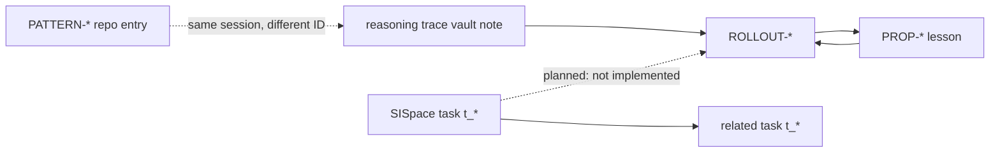

# Harness knowledge graph

How rollout logs, proposals (props), reflections, reasoning patterns, and SISpace task notes relate — and which links are intentional vs noise.

**Source of truth:** repo files under `harness/memory/` and `harness/reports/`.  
**Searchable mirror:** Obsidian vault at `harness/config/obsidian.yaml` → `vault_root` (default `/home/lev/harness vault`).

See also: [obsidian-task-schema.md](./obsidian-task-schema.md), [.cursor/hooks/lib/obsidian-sync.md](../.cursor/hooks/lib/obsidian-sync.md).

---

## Entity types

| Entity | ID format | Repo location | Vault mirror (if any) | Created when |
| --- | --- | --- | --- | --- |
| **Task** | `t_*` | SQLite + `SISpace/tasks/t_*.md` | Same path in vault | SISpace task create |
| **Rollout event** | `ROLLOUT-*-sdk` | `harness/reports/rollout-log.md` | `Harness/rollout-log/ROLLOUT-*.md` | Every post-task chain run |
| **Proposal / lesson** | `PROP-*` | `accepted-lessons.md`, `rejected-lessons.md`, or `pending-proposals.md` | `Harness/accepted-lessons/`, `rejected-lessons/` | Graded reflection with a proposal |
| **Reasoning pattern (repo)** | `PATTERN-*` | `harness/memory/reasoning-patterns.md` | *(not mirrored as PATTERN)* | Post-task chain when reflection fields are complete |
| **Reasoning trace (vault)** | session UUID or `t_*` | — | `Harness/reasoning-patterns/{id}.md` | Same post-task chain (Obsidian sync) |
| **Latest reflection** | — | `harness/reports/latest-reflection.md` | *(not mirrored)* | Overwritten each chain |
| **Latest grade** | — | `harness/reports/latest-grade.md` | *(not mirrored)* | Overwritten each chain |
| **Pending proposal** | `PROP-*` / `PENDING-*` | `harness/memory/pending-proposals.md` | *(not mirrored)* | Grade decision `revise` |

Each entity type has one role. Do not reuse IDs across types (e.g. do not file `t_*` notes under `Harness/reasoning-patterns/`).

---

## Allowed edges (meaningful links)

Link only when the relationship is causal or navigational — not “everything to everything.”



| From | To | Mechanism today | Semantics |
| --- | --- | --- | --- |
| Rollout vault note | Accepted/rejected lesson | `## Related` wikilink (post-task sync) | This rollout graded/applied that proposal |
| Lesson vault note | Rollout vault note | `## Related` wikilink | Same grading event |
| Reasoning vault note | Rollout vault note | `## Related` wikilink | Session trace for that rollout |
| Task note | Other tasks | `## Links` at create | Related Kanban work |
| Hub `Harness/README` | Exemplar notes | Manual curation | Entry points into the graph |

**Planned (not implemented):** task note → rollout / proposal / pattern after SISpace approve-reflect. Until then, task ↔ harness connection is prose in rollout-log entries only.

---

## Explicit non-links

Do **not** wikilink these — they create false graph density:

| Avoid linking | Why |
| --- | --- |
| `latest-reflection.md`, `latest-grade.md` | Ephemeral; overwritten every chain |
| Hub README → every rollout | Manual MOC lists exemplars only |
| Duplicate `PROP-*` IDs | Same ID reused for unrelated lessons breaks semantics (known ledger issue) |
| Unrelated tasks | Task `related` is for work dependency, not session UUID |
| Pending proposals to vault | Not synced; link would be stale |
| Repo `PATTERN-*` ↔ vault reasoning note | Different IDs; correlate by session ID in rollout prose |

---

## Post-task chain flow

```
Task work (Cursor session or SISpace approve → invoke-chain.sh)
  → harness/scripts/dist/post-task-chain.js
      → reflection agent  → latest-reflection.md
      → grading agent     → latest-grade.md
      → gate              → apply | log_only | blocked_locked_layer | no_proposal
      → appendReasoningPattern → reasoning-patterns.md (PATTERN-*)
      → appendMemoryOutcome    → accepted | rejected | pending ledgers
      → appendRolloutEntry     → rollout-log.md (ROLLOUT-*)
      → syncObsidianEntries    → vault notes + ## Related
```

**Session ID for vault reasoning notes:** Cursor hook uses the real session UUID. SISpace uses `cursor_agent_id` if set, else `task.id` (`src-tauri/src/services/harness_client.rs`).

**Triggers:**

| Trigger | Task note updated? | Harness artifacts |
| --- | --- | --- |
| Cursor SDK post-task hook (`output_tokens ≥ 1000`) | No | Full chain + vault sync |
| SISpace `task_approve_complete` | Status only (`complete` → `reflected` → `learned`) | Full chain + vault sync |

---

## Kanban lifecycle vs harness artifacts

| Kanban status | Harness artifacts typically present |
| --- | --- |
| `todo` … `in_review` | Task note only; pipeline messages in SQLite |
| `complete` | Reflect chain started |
| `reflected` | `latest-reflection.md`, rollout entry, vault sync (if token set) |
| `learned` | Grade accept / accept-with-human-review; lesson ledger may update |

In-review UI (`ReflectPreviewDialog`) shows **inputs** to reflection (reviewer/tester/transcript), not predicted rollout links.

---

## ID hygiene

- **One proposal, one ID:** Reuse of `PROP-*` for different substance makes vault links ambiguous. Resubmit under a fresh ID (e.g. `PROP-20250603-009`) when grading says “collision.”
- **Path-qualified wikilinks:** Always `[[SISpace/tasks/t_abc]]`, `[[Harness/rollout-log/ROLLOUT-…]]` — not bare `[[t_abc]]`.
- **Stale vault notes:** Rollouts synced before `appendLinksSection` may lack `## Related`. New syncs do not backfill old notes automatically.

---

## Operator checklist

After changing link logic in `harness/scripts/src/lib/obsidian.ts` or `post-task-chain.ts`:

1. Ensure `harness/scripts/dist/` matches `harness/scripts/src/` (dist is committed in this repo; recompile when TypeScript changes).
2. Run one graded post-task chain with `OBSIDIAN_API_KEY` set so new vault notes get `## Related`.
3. Verify:

```bash
node --test tests/obsidian-append-links.test.mjs
node tests/verify-obsidian-vault-graph.mjs
sh harness/scripts/verify-obsidian-integration.sh
```

With `OBSIDIAN_API_KEY` set, vault-graph also exercises live POST search.

**Note:** Accepted lesson PROP-20250603-007 describes a `--require-sync-links` flag on `verify-obsidian-vault-graph.mjs`. That flag is **not implemented yet**; the script spot-checks hub notes and sample synced pairs from `Harness/README.md`.

---

## Vault hubs

| Hub | Purpose |
| --- | --- |
| `Harness/README.md` | Index of harness mirror folders + exemplar links |
| `SISpace/README.md` | Index of task notes + link to harness hub |

Both live in the same vault as task notes (`SISpace/tasks/`). A separate persistent-memory vault is not required.
